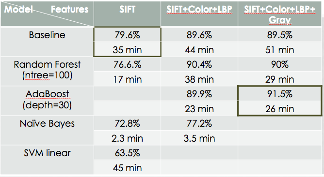
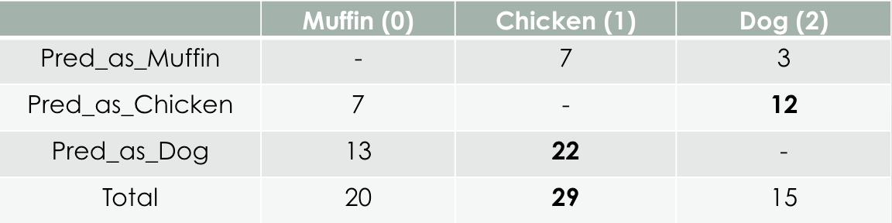
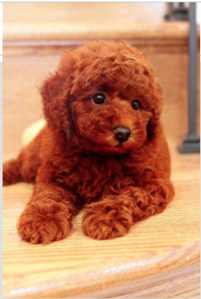
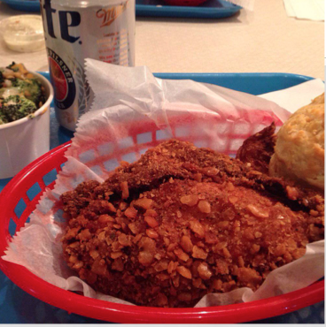

# Project: Dogs, Fried Chicken or Blueberry Muffins?


### [Full Project Description](doc/project3_desc.md)

Term: Fall 2017

+ Team 9
+ Team members
	+ Xinghu Wang
	+ Xin Luo
	+ Sihui Shao
	+ Yina Wei


+ Project summary: In this project, we created a classification engine for images of dogs versus fried chicken versus blueberry muffins. 
	+ This project includes three stages, features extractions, model selections and prediction. In the feature extractions, we tried to extract color features, LBP, gray, HOG and ORB features. For 3,000 images, every feture extraction method spends 10-15 mins.For model selections, we tried Xgboost, GBM, adaboost, random forest, naive bayes, SVM (linear & kernel), and convolutional neutral network(CNN). 
	+ Baseline model: GBM model with all SIFT features. Test Error: 0.21, training time: 35 mins.
	+ Advanced model: Adaboost model with all SIFT, color, LBP and gray features. Test Error: 0.085, training time: 26 mins. 
	+ Here is a brief comparison for the models: 
		

+ Possible Improvement: After testing on 750 images, we move forward to find out the most common misclassification cases and the possible improvement in the future. From the following table, we found that our model is more likely to misclassify fried chicken and dogs: 
		


	+ Add or deselect features: similar textures and colors may cause misclassification. For example, below are two figure samples which are classified as wrong group. Dog and fried chicken in those figures have similar textures and colors. And our model may confuse with those features.  Therefore, one of the possible improvement include further feature selections (add more features or delete "common" features).
	
	
		
		
**Contribution statement**: ([default](doc/a_note_on_contributions.md)) All team members contributed equally in all stages of this project. All team members approve our work presented in this GitHub repository including this contributions statement.
+ Xin Luo: Construct the main/train/test/features files, extract color/gray/blob/mser features, train/test baseline, Xgboost and Adaboost models
+ Xinghu Wang: Extract HOG features, train/test Random Forest Model, prepare presentation and presentor 
+ Sihui Shao: Extract LBP & ORB features, train/test Naive Bayes, SVM and Multi-layer perceptron Model
+ Yina Wei: Extract gray/color features, train/test CNN (convolutional neural network) Model

Following [suggestions](http://nicercode.github.io/blog/2013-04-05-projects/) by [RICH FITZJOHN](http://nicercode.github.io/about/#Team) (@richfitz). This folder is orgarnized as follows.

```
proj/
├── lib/
├── data/
├── doc/
├── figs/
├── output/
```

Please see each subfolder for a README file.
